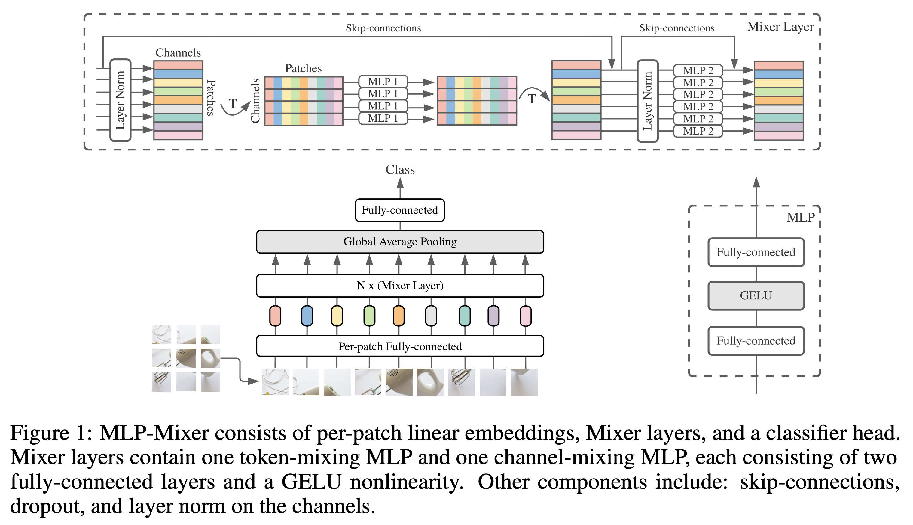
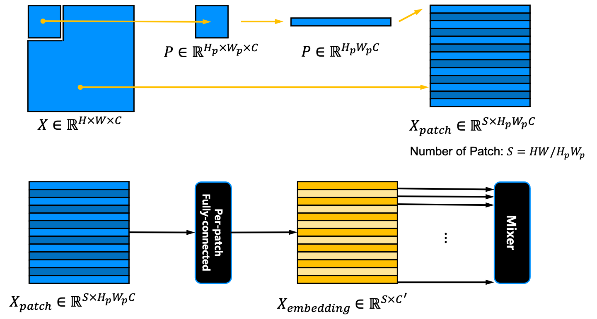
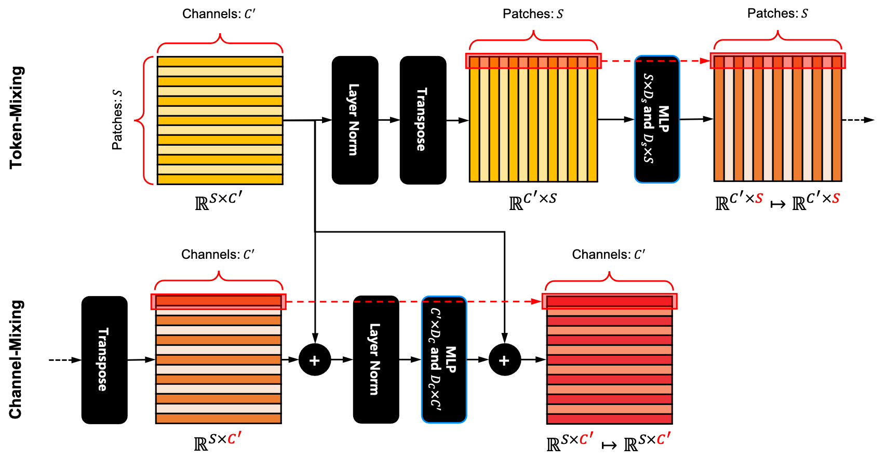
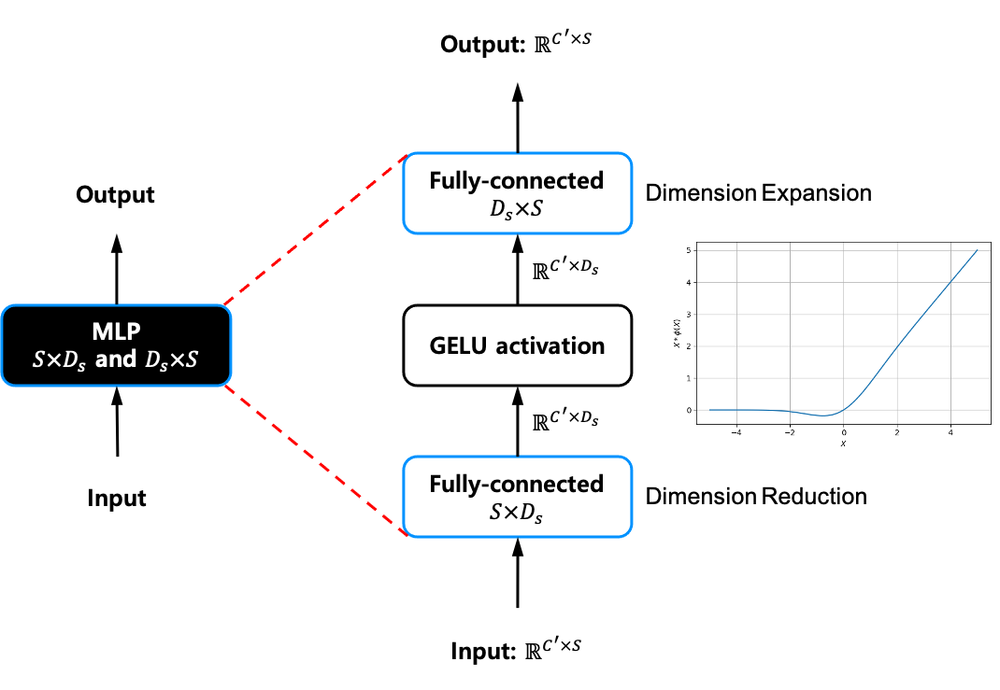
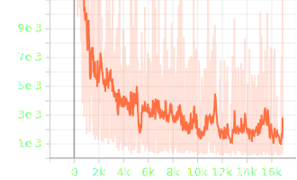
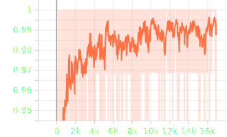

[PyTorch] MLP-Mixer: An all-MLP Architecture for Vision
=====
PyTorch implementation of "MLP-Mixer: An all-MLP Architecture for Vision"

## Concept
<div align="center">
    
  <p>The MLP-Mixer architecture [1].</p>
</div>

### Patch Embedding
<div align="center">
    
</div>

### Mixer Block
<div align="center">
    
</div>

### MLP in Mixer Blcok
<div align="center">
    
</div>

## Results

### Loss & Accuracy

    

### Performance

|Indicator|Value|
|:---|:---:|
|Accuracy|0.98330|
|Precision|0.98321|
|Recall|0.98307|
|F1-Score|0.98311|

```
Confusion Matrix
[[ 970    1    2    1    1    0    3    1    1    0]
 [   0 1125    3    4    0    1    0    1    1    0]
 [   0    0 1026    1    1    0    1    2    1    0]
 [   0    0    2  998    0    4    0    4    2    0]
 [   0    0    0    0  962    0    4    3    0   13]
 [   1    1    0   18    0  864    3    2    3    0]
 [   3    3    2    1    4    4  940    0    1    0]
 [   0    0    6    0    0    0    0 1021    1    0]
 [   6    1    3    2    2    3    1    3  950    3]
 [   1    3    0    3    4    5    0   13    2  978]]
Class-0 | Precision: 0.98879, Recall: 0.98980, F1-Score: 0.98929
Class-1 | Precision: 0.99206, Recall: 0.99119, F1-Score: 0.99163
Class-2 | Precision: 0.98276, Recall: 0.99419, F1-Score: 0.98844
Class-3 | Precision: 0.97082, Recall: 0.98812, F1-Score: 0.97939
Class-4 | Precision: 0.98768, Recall: 0.97963, F1-Score: 0.98364
Class-5 | Precision: 0.98070, Recall: 0.96861, F1-Score: 0.97462
Class-6 | Precision: 0.98739, Recall: 0.98121, F1-Score: 0.98429
Class-7 | Precision: 0.97238, Recall: 0.99319, F1-Score: 0.98268
Class-8 | Precision: 0.98753, Recall: 0.97536, F1-Score: 0.98140
Class-9 | Precision: 0.98390, Recall: 0.96928, F1-Score: 0.97654

Total | Accuracy: 0.98340, Precision: 0.98340, Recall: 0.98306, F1-Score: 0.98319
```

## Requirements
* PyTorch 1.11.0

## Reference
[1] Tolstikhin, Ilya O., et al. <a href="https://proceedings.neurips.cc/paper/2021/file/cba0a4ee5ccd02fda0fe3f9a3e7b89fe-Paper.pdf">"Mlp-mixer: An all-mlp architecture for vision."</a> Advances in Neural Information Processing Systems 34 (2021).
